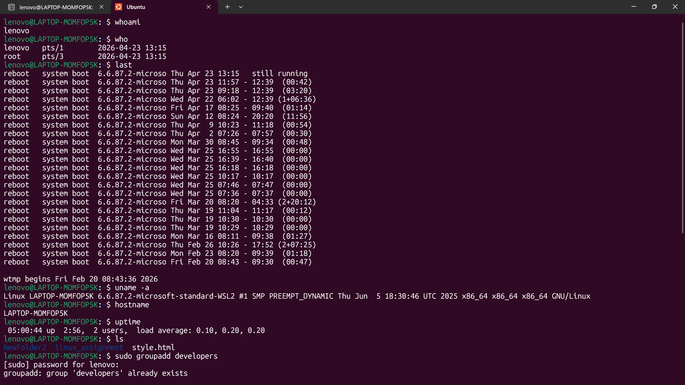
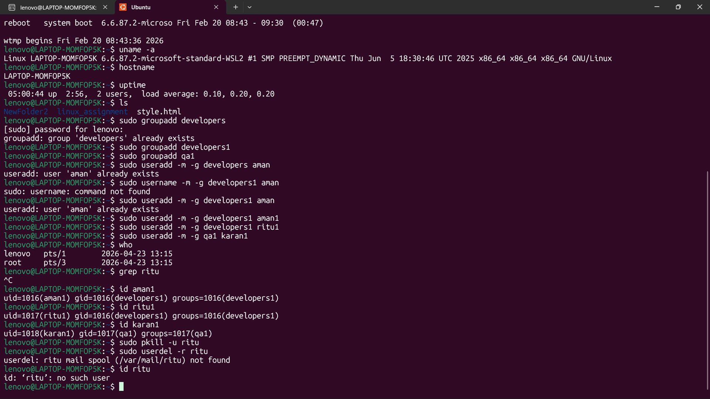

## 1. Check current logged-in user
whoami

## 2. Check users currently logged in and activity
who

## 3. View login history
last

## 4. Display complete system info, hostname, uptime
```bash
uname -a
hostname
uptime
```

## 5. Create groups developers1 and qa1
```bash
sudo groupadd developers1
sudo groupadd qa1
```

## 6. Create users and assign groups
```bash
sudo useradd -m -g developers1 aman1
sudo useradd -m -g developers1 ritu1
sudo useradd -m -g qa1 karan1
```

## 7. Verifying whether users exist or not
```bash
id aman
id ritu
id karan
```

## 8. Delete resigned employee ritu
```bash
sudo pkill -u ritu
sudo userdel -r ritu
```

## 9. Verifying deletion
id ritu


