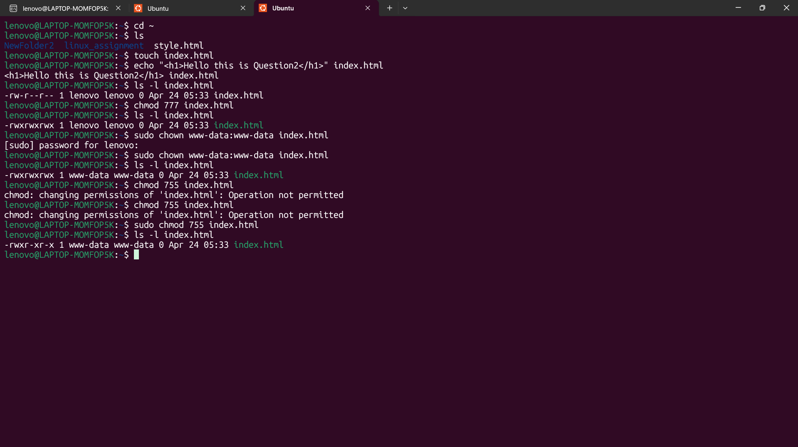

## 1. Navigate to home directory
cd ~

## 2. Create index.html file
touch index.html

## 3. Add HTML content
```bash
echo "<h1>Hello this is Question2</h1>" > index.html
```

## 4. Check current default permissions
ls -l index.html

## 5. Grant full permissions to all users
chmod 777 index.html

## Verify permissions
ls -l index.html

## 6. Change owner and group to www-data
```bash
sudo chown www-data:www-data index.html
ls -l index.html
```

## 7. Change permissions to 755
```bash
sudo chmod 755 index.html
ls -l index.html
```


